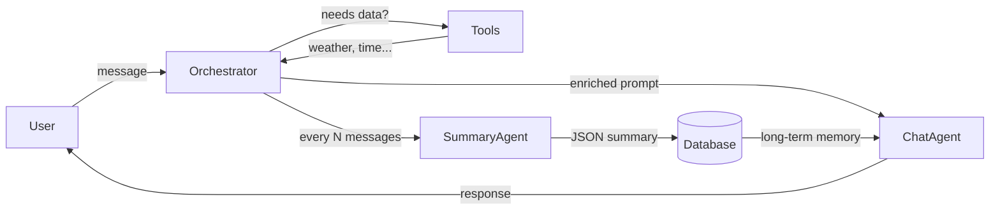
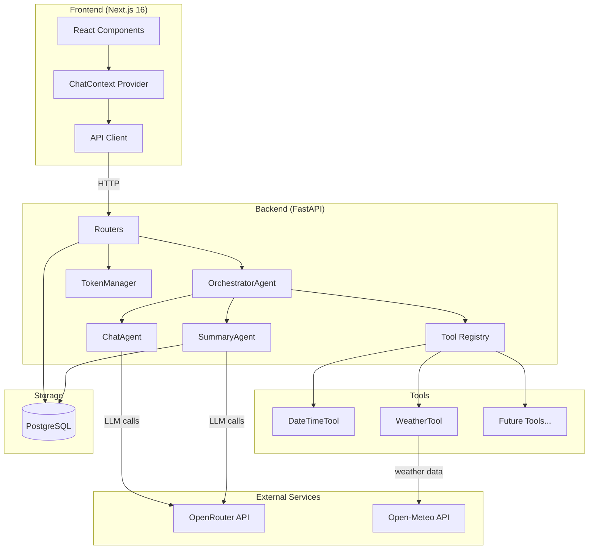
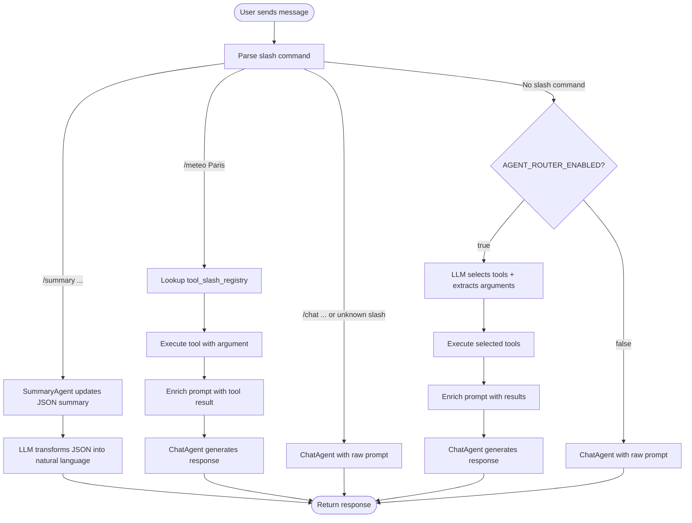
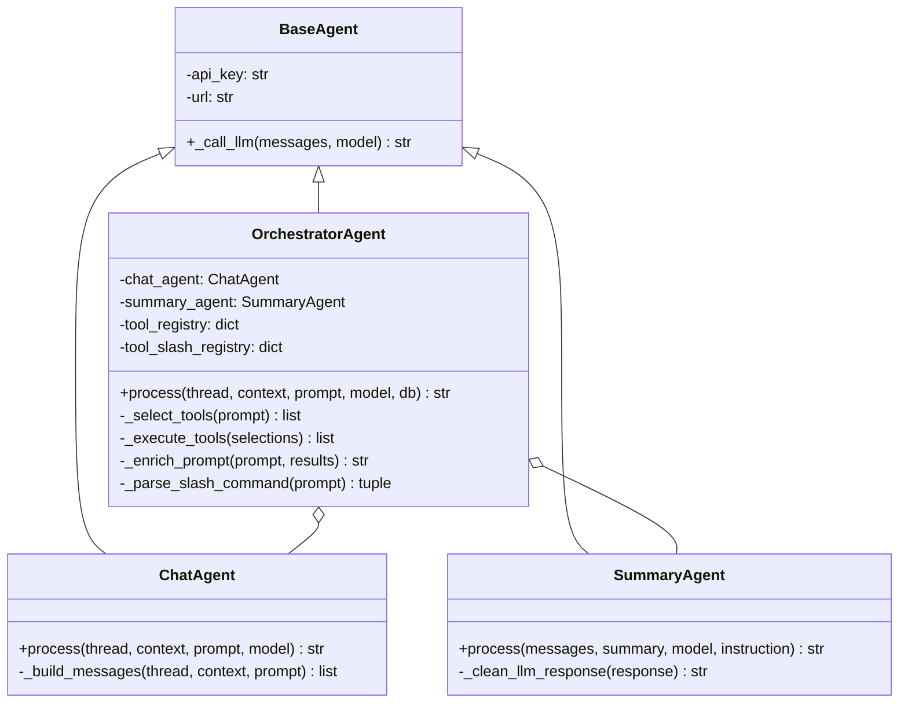
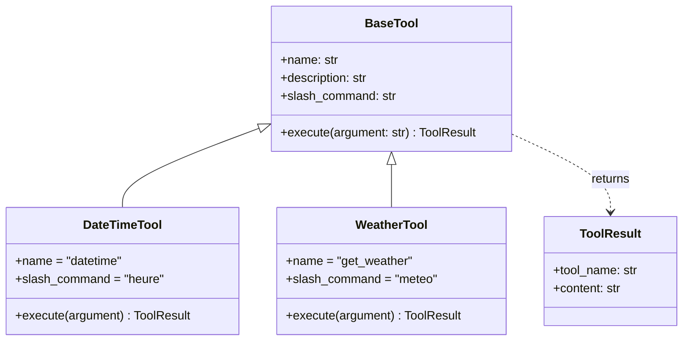
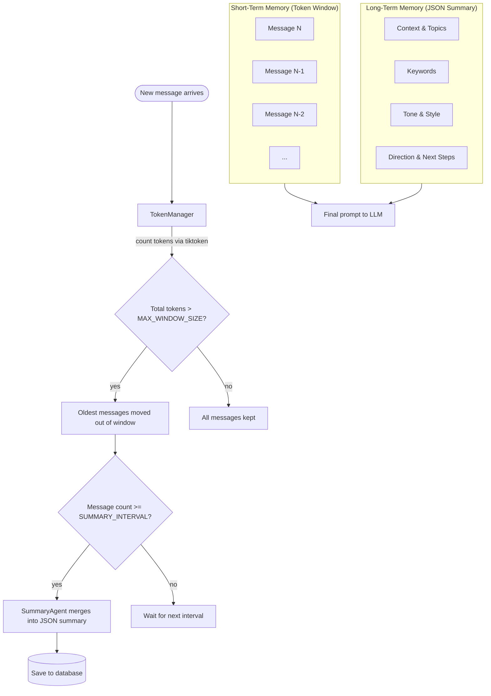
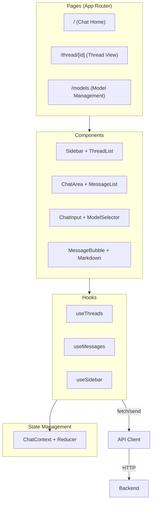
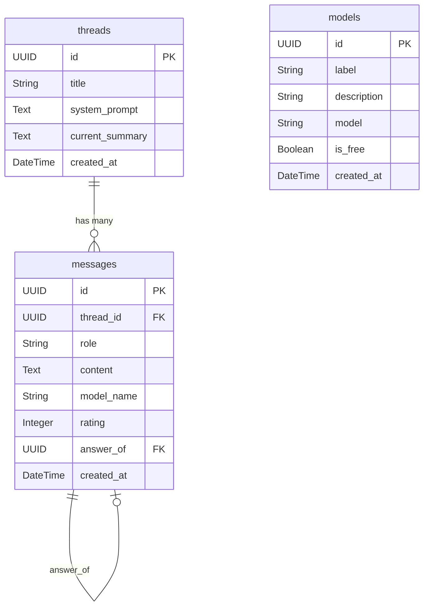

# SuperQ — Multi-Agent Contextual AI Platform

SuperQ is a full-stack AI chat platform featuring a multi-agent architecture with tool integration and hybrid memory management. It goes beyond simple chat: the orchestrator understands user intent, calls external tools when needed, and maintains long-term memory across conversations.

## Table of Contents

- [How It Works](#how-it-works)
- [User Guide](#user-guide)
  - [Conversations](#conversations)
  - [Slash Commands](#slash-commands)
  - [Natural Language Tool Usage](#natural-language-tool-usage)
  - [Memory & Context](#memory--context)
  - [Models](#models)
- [Architecture](#architecture)
  - [High-Level Overview](#high-level-overview)
  - [Orchestrator Flow](#orchestrator-flow)
  - [Agents](#agents)
  - [Tools](#tools)
  - [Memory System](#memory-system)
  - [Frontend Architecture](#frontend-architecture)
- [API Reference](#api-reference)
- [Database Schema](#database-schema)
- [Getting Started](#getting-started)
  - [Prerequisites](#prerequisites)
  - [Configuration](#configuration)
  - [Launch](#launch)
  - [Development](#development)
- [Tech Stack](#tech-stack)
- [Project Structure](#project-structure)

---

## How It Works

SuperQ doesn't just relay messages to an LLM. Every user message goes through an **orchestrator** that decides the best course of action before generating a response.



When you ask *"What's the weather in Paris?"*, the orchestrator detects that external data is needed, calls the weather tool, injects the result into the prompt, and the ChatAgent formulates a natural response using that real data.

When you ask *"Explain quantum computing"*, no tool is needed — the orchestrator passes the prompt directly to the ChatAgent.

---

## User Guide

### Conversations

SuperQ organizes chats into **threads**. Each thread is an independent conversation with its own message history, memory, and optional system prompt.

- **Create a thread** using the sidebar button — give it a title and optionally a system prompt to define the assistant's behavior (e.g., *"You are a Python expert"*)
- **Switch between threads** via the left sidebar
- **Rate responses** to provide feedback on AI answers
- **Delete messages** individually or delete entire threads
- **Choose AI models** from the model selector in the input area

### Slash Commands

Slash commands let you directly trigger specific actions:

| Command | Description | Example |
|---------|-------------|---------|
| `/meteo <city>` | Get current weather for a city | `/meteo Paris` |
| `/heure` | Get current date and time | `/heure` |
| `/summary` | Get a natural language summary of the conversation | `/summary` |
| `/summary <instruction>` | Get a focused summary | `/summary Focus on technical decisions` |
| `/chat <message>` | Force direct chat (bypass tool selection) | `/chat Hello!` |

Slash commands bypass the LLM-based tool selection — they execute the tool immediately and pass the result to the ChatAgent for a natural response.

### Natural Language Tool Usage

When `AGENT_ROUTER_ENABLED=true`, the orchestrator uses a lightweight LLM call to detect tool needs from natural language:

```
"What time is it?"              → automatically calls datetime tool
"Weather in Tokyo?"             → automatically calls weather tool
"What time is it and weather?"  → calls both tools
"Tell me a joke"                → no tool needed, direct to ChatAgent
```

The system can call **multiple tools** in a single request and combine their results before generating a response.

### Memory & Context

SuperQ automatically manages conversation memory:

- **Short-term memory**: The most recent messages (within a configurable token window) are sent with each request
- **Long-term memory**: Every few messages, a SummaryAgent creates a structured JSON summary that captures context, keywords, tone, and conversation direction
- **Seamless**: You don't need to do anything — memory management happens transparently in the background

You can inspect the current memory state at any time with the `/summary` command.

### Models

SuperQ connects to multiple AI models through [OpenRouter](https://openrouter.ai/). You can:

- **Switch models** on the fly using the model selector in the input area
- **Add/remove models** from the models management page
- Models support both free and paid tiers

---

## Architecture

### High-Level Overview



### Orchestrator Flow

The orchestrator is the brain of the system. Here's how it processes every incoming message:



### Agents

SuperQ uses three cooperating agents, all extending a common `BaseAgent`:



| Agent | Role | Input | Output |
|-------|------|-------|--------|
| **OrchestratorAgent** | Routes requests, selects tools, enriches prompts | Raw user message | Delegates to ChatAgent or SummaryAgent |
| **ChatAgent** | Generates natural language responses | Prompt (raw or enriched) + context + memory | Text response |
| **SummaryAgent** | Compresses conversation into structured JSON | Recent messages + current summary | JSON summary (context, keywords, tone, direction) |

### Tools

Tools provide external data that the LLM doesn't have natively. They follow a simple interface:



**Adding a new tool** requires:

1. Create a class extending `BaseTool` in `backend/app/services/tools/`
2. Define `name`, `description`, and optionally `slash_command`
3. Implement `async execute(self, argument: str) -> ToolResult`
4. Register it in `OrchestratorAgent.__init__()` with `self._register_tool(YourTool())`

The `description` field is critical — it's what the LLM-based selector reads to decide whether to call your tool.

**Tool ideas**: web search, file reader, calendar integration, database queries, code execution, API calls, batch jobs...

### Memory System

SuperQ implements a hybrid memory architecture to handle long conversations without losing context:



**How the ChatAgent builds its prompt:**

```
┌─────────────────────────────────────────┐
│ System Prompt (from thread config)      │
├─────────────────────────────────────────┤
│ Long-Term Memory (JSON summary)         │
│ → context, keywords, tone, direction    │
├─────────────────────────────────────────┤
│ Recent Messages (within token window)   │
│ → user/assistant message pairs          │
├─────────────────────────────────────────┤
│ Current User Prompt                     │
│ (raw or enriched with tool results)     │
└─────────────────────────────────────────┘
```

**Configuration:**

| Setting | Default | Description |
|---------|---------|-------------|
| `MAX_WINDOW_SIZE` | 2000 | Maximum tokens for the short-term message window |
| `SUMMARY_INTERVAL` | 6 | Number of messages before triggering a summary update |

### Frontend Architecture

The frontend follows Next.js App Router conventions with a centralized state via React Context:



**Key UI features:**
- Dual sidebar layout (threads on the left, settings on the right)
- Markdown rendering with syntax highlighting (GitHub Dark theme)
- Skeleton loaders and loading states
- Infinite scroll for message history
- Per-message rating system
- Responsive design with dark mode support

---

## API Reference

### Threads

| Method | Endpoint | Description |
|--------|----------|-------------|
| `POST` | `/threads` | Create a new thread |
| `GET` | `/threads` | List all threads (paginated) |
| `GET` | `/threads/{thread_id}` | Get a specific thread |
| `PATCH` | `/threads/{thread_id}` | Update thread title or system prompt |
| `DELETE` | `/threads/{thread_id}` | Delete thread and all its messages |

### Messages

| Method | Endpoint | Description |
|--------|----------|-------------|
| `GET` | `/threads/{thread_id}/messages` | Get messages (paginated, newest first) |
| `POST` | `/threads/{thread_id}/messages` | Send a message and receive AI response |
| `PATCH` | `/threads/{thread_id}/messages/{id}/rate` | Rate an assistant response |
| `DELETE` | `/threads/{thread_id}/messages/{id}` | Delete a user-assistant message pair |

### Models

| Method | Endpoint | Description |
|--------|----------|-------------|
| `GET` | `/models/models` | List all registered AI models |
| `POST` | `/models/models` | Register a new model |
| `DELETE` | `/models/models/{id}` | Remove a model |

Interactive documentation available at `http://localhost:8000/docs` (Swagger) and `http://localhost:8000/redoc` (ReDoc).

---

## Database Schema



- **threads**: Each conversation with its own system prompt and long-term memory summary
- **messages**: User and assistant messages linked by `answer_of` (pairs), with optional rating
- **models**: Available LLM configurations pulled from OpenRouter

---

## Getting Started

### Prerequisites

- **Docker** and **Docker Compose**
- An **[OpenRouter](https://openrouter.ai/) API key**

### Configuration

Create a `.env` file:

```env
# --- API ---
OPENROUTER_API_KEY=sk-or-v1-your-key-here

# --- Database ---
DB_USER=postgres
DB_PASSWORD=change_this_password
DB_NAME=superq_db
DB_HOST=db
DB_PORT=5432

# --- Agent Routing ---
AGENT_ROUTER_ENABLED=true

# --- Frontend ---
NEXT_PUBLIC_API_URL=http://localhost:8000
```

### Launch

```bash
docker-compose up --build
```

| Service | URL |
|---------|-----|
| Frontend | http://localhost:3000 |
| Backend API | http://localhost:8000 |
| API Docs (Swagger) | http://localhost:8000/docs |
| API Docs (ReDoc) | http://localhost:8000/redoc |
| Database | localhost:5432 |

### Development

**Backend** (without Docker):

```bash
cd backend
pip install -r requirements.txt
uvicorn app.main:app --reload --port 8000
```

**Frontend** (without Docker):

```bash
cd frontend
npm install
npm run dev
```

---

## Tech Stack

| Layer | Technology |
|-------|-----------|
| Frontend | Next.js 16, React 19, TypeScript 5, Tailwind CSS 4 |
| Backend | FastAPI, SQLAlchemy, Python 3.11 |
| Database | PostgreSQL 15 |
| LLM Provider | OpenRouter (Gemini, GPT, Claude...) |
| Token Counting | tiktoken |
| HTTP Client | httpx (async, with retry logic) |
| Infrastructure | Docker & Docker Compose |
| Markdown | react-markdown, rehype-highlight, remark-gfm |

---

## Project Structure

```
SuperQ/
├── docker-compose.yml
├── README.md
│
├── backend/
│   ├── Dockerfile
│   ├── requirements.txt
│   ├── .env
│   └── app/
│       ├── main.py                          # FastAPI entry point
│       ├── models.py                        # SQLAlchemy ORM models
│       ├── schemas.py                       # Pydantic schemas
│       ├── database.py                      # DB engine & sessions
│       ├── core/
│       │   └── config.py                    # Centralized settings
│       ├── routers/
│       │   ├── threads.py                   # Thread CRUD endpoints
│       │   ├── messages.py                  # Message endpoints + orchestration
│       │   └── models.py                    # Model management endpoints
│       └── services/
│           ├── token_manager.py             # Token counting & context optimization
│           ├── agents/
│           │   ├── base.py                  # BaseAgent (LLM calls + retry)
│           │   ├── orchestrator.py          # Routing, tool selection, dispatch
│           │   ├── chat.py                  # Conversation & prompt building
│           │   └── summary.py              # JSON summary generation
│           └── tools/
│               ├── base.py                  # BaseTool + ToolResult
│               ├── datetime_tool.py         # Date/time tool
│               └── weather_tool.py          # Weather tool (Open-Meteo API)
│
└── frontend/
    ├── Dockerfile
    ├── package.json
    ├── next.config.ts
    └── src/
        ├── app/
        │   ├── layout.tsx                   # Root layout
        │   ├── globals.css                  # Tailwind + theme
        │   ├── (chat)/
        │   │   ├── page.tsx                 # Chat home
        │   │   └── thread/[id]/page.tsx     # Thread view
        │   └── models/page.tsx              # Model management
        ├── components/
        │   ├── sidebar/                     # Sidebar, thread list, modals
        │   ├── chat/                        # Chat area, messages, markdown
        │   ├── input/                       # Chat input, model selector
        │   └── ui/                          # Modal, spinner, skeleton...
        ├── contexts/
        │   └── chat-context.tsx             # Global state (React Context + Reducer)
        ├── hooks/
        │   ├── use-threads.ts               # Thread CRUD logic
        │   ├── use-messages.ts              # Message loading & sending
        │   └── use-sidebar.ts               # Sidebar toggle state
        ├── lib/
        │   ├── api.ts                       # HTTP client functions
        │   └── constants.ts                 # App constants
        └── types/
            └── index.ts                     # TypeScript interfaces
```
